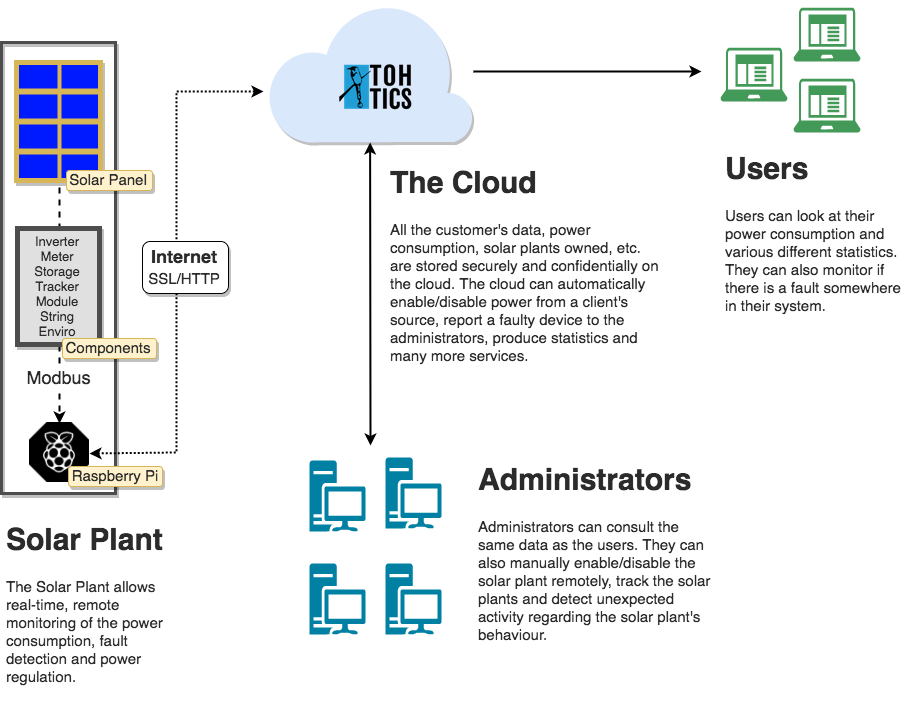

# Solar Plant Monitoring System

The system consists in obtaining data from "Solar Plants" which produce electricity
and send relevant data, like power consumption, to the cloud. From there, we can
choose to cut the power or detect faulty devices.

# About
This software is licensed under the AGPL.
